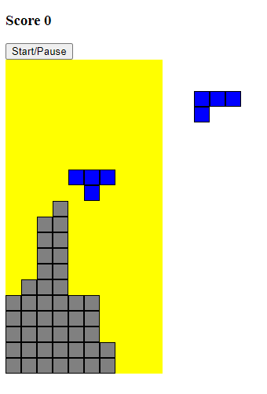
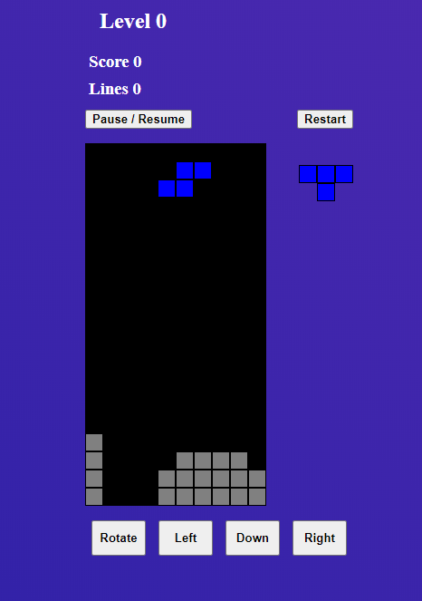

# Tetris dom

DOM based tetris, with fully working collision, lines, levels, score and next piece.

<!--  -->

  

The rotation of the pieces, collision, the random piece algorithm and the speed of each level are based in the classic Ness game.

You can play with the arrow keys, the buttons and gestures!
